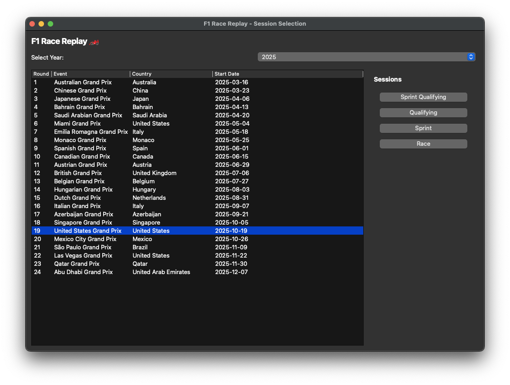
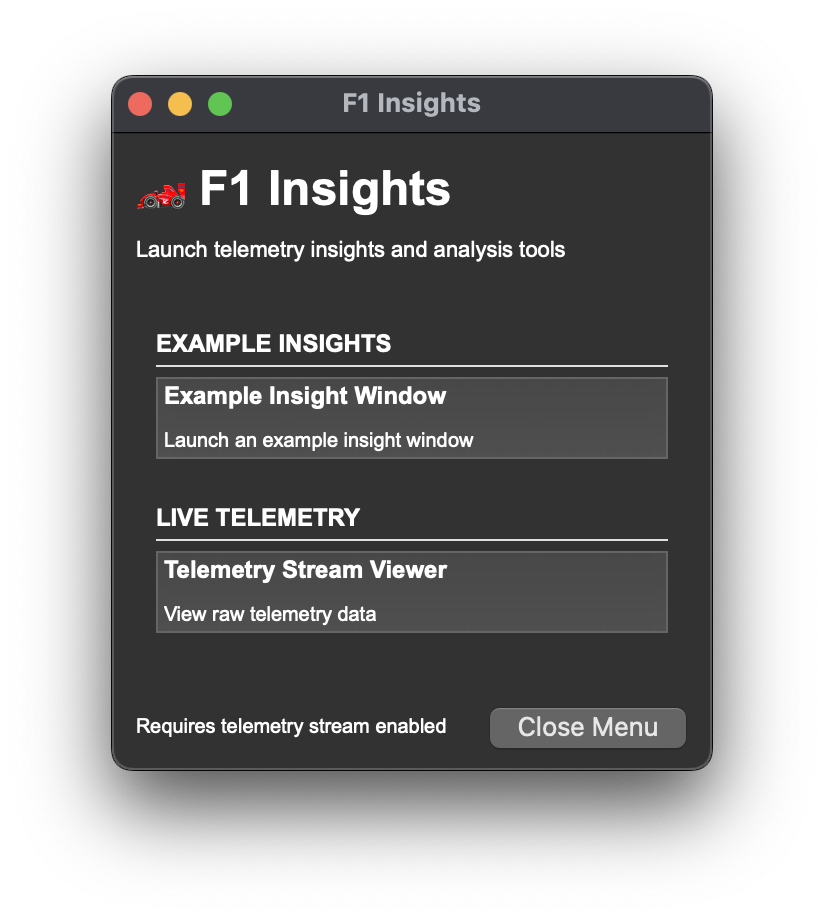

<div align="center">
  <h1>AI Motorsport Intelligence Replay</h1>

  <p><strong>Replay the race. Explain the decision.</strong></p>
  <p>
    An interactive Formula 1 telemetry replay with a hierarchical AI race engineer.<br />
    Explore public race data, understand the hidden tactical state, and test what could have happened next.
  </p>

  <p>
    <a href="#install">Install</a> ·
    <a href="#judge-mode">Judge Mode</a> ·
    <a href="replay_ai/docs/ARCHITECTURE.md">Architecture</a> ·
    <a href="replay_ai/docs/AIBackend.md">AI backend</a> ·
    <a href="#project-status">Status</a>
  </p>

  <p>
    <a href="#requirements"></a>
    <a href="#architecture"></a>
    <a href="#judge-mode"></a>
    <a href="#project-status"></a>
  </p>
</div>

> [!IMPORTANT]
> **This is pre-release research software.** The AI layer uses public telemetry and estimates an opponent's ERS capability state; FastF1 does not provide rival battery state of charge, MGU-K deployment, or override availability. Checked-in HMM and lap-time artifacts are synthetic development artifacts, not private F1 data or race-validated ground truth.

## Why this project?

Most race replays answer **what happened**. This project also asks:

> **What should we do, and why?**

The recorded replay remains the source of truth. The intelligence layer sits beside it and turns observable signals—speed, throttle, braking, gaps, lap timing, tyres, and active-aero/DRS proxies—into an auditable tactical recommendation. When we want to ask “what if?”, the app starts an isolated counterfactual simulation rather than rewriting the recorded race.

The repository contains two runnable versions:

| Directory | Role |
| --- | --- |
| [`replay/`](replay/) | The original F1 replay baseline, preserved for comparison. |
| [`replay_ai/`](replay_ai/) | The canonical AI Motorsport Intelligence implementation and current product. |

All active model, simulation, evaluation, and Judge Mode work belongs in `replay_ai/`.

## See it in action

<p align="center">
  <a href="replay_ai/resources/preview.png">
    
  </a>
  <br />
  <sub><strong>Replay the race, then interrogate the moment.</strong> The canonical app combines a live track view, leaderboard, driver telemetry, and replay controls.</sub>
</p>

<table>
  <tr>
    <td width="50%">
      <a href="replay_ai/resources/gui-menu.png">
        
      </a>
    </td>
    <td width="50%">
      <a href="replay_ai/resources/insights-menu.png">
        
      </a>
    </td>
  </tr>
  <tr>
    <td align="center"><strong>Choose a session</strong><br /><sub>Select a season, round, and replay type from the native GUI.</sub></td>
    <td align="center"><strong>Open the pit wall</strong><br /><sub>Launch telemetry, race engineer, tyre, lap-time, and track-position insights.</sub></td>
  </tr>
</table>

<p align="center"><sub>Actual application screenshots. Click any image to view it full size.</sub></p>

## What it does

### Replay the race

- Render driver positions on the circuit as the session progresses
- Follow the leaderboard, lap counter, race clock, tyre compounds, and driver status
- Visualize Safety Car deployment with simulated on-track positioning and deployment phases
- Pause, seek, restart, change playback speed, and focus on a battle
- Replay Race, Sprint, Qualifying, and Sprint Qualifying sessions when FastF1 provides the data

### Understand the battle

- Select one or more drivers from the leaderboard
- Toggle Focus / Battle Mode to highlight the selected car and nearby rivals
- Inspect speed, gear, throttle, brake, DRS, gap, lap, and tyre information
- Open the Insights Menu for live telemetry and pit-wall-style analysis windows
- Stream replay telemetry to custom `PitWallWindow` extensions

### Make the AI recommendation legible

Judge Mode turns the technical backend into a presentation-ready decision view:

- A dominant tactical command: `ATTACK NOW`, `PROTECT RESERVE`, or `PROBE / TRAP`
- Confidence, decision validity, expected gap impact, energy cost, and remaining reserve
- Four visual ERS capability-belief bars, including the critical `Lharvest` versus `Lderate` distinction
- Causal evidence showing which public observations changed the model
- Understandable action comparisons for `BURN`, `HARVEST`, and `PROACTIVE TRAP`
- Model provenance, units, envelope feasibility, search diagnostics, and update status
- A six-step **How It Works** walkthrough designed for a deterministic Monza presentation

### Test the alternative

Press **C** from a paused replay frame to launch a separate counterfactual branch. The branch compares tactical actions from the same publicly observed state and reports the projected gap, energy, and outcome. The recorded replay is never mutated.

The UI labels the distinction explicitly:

- `REAL TELEMETRY REPLAY` — recorded public observations; history cannot change
- `COUNTERFACTUAL SIMULATION` — an isolated model branch starting from the selected replay frame

### Keep the evidence auditable

The runtime makes the information boundary visible. Public observations feed the inference layer; estimated beliefs and simulated outcomes are labelled as such. The current architecture intentionally does not claim to measure rival SOC or prove race-winning performance without authorized ground truth.

## Judge Mode

Judge Mode is the fastest way to demonstrate the product to someone seeing it for the first time.

### One-minute demo

From the repository root:

```bash
cd replay_ai
python main.py --viewer --year 2026 --round 13
```

Then:

1. Select a driver in the leaderboard and pause the replay.
2. Press **J** to show the decision-first Judge panel.
3. Press **H** or **?** for the guided walkthrough.
4. Use **5–0** to jump to deterministic Monza scenario bookmarks, or **N/P** to move between them.
5. Press **C** to compare the isolated counterfactual actions.
6. Press **SPACE** to return to the recorded replay.

The first-run hint points to the walkthrough automatically. The scenario path demonstrates telemetry evidence, belief updates, rejected alternatives, and recorded-versus-counterfactual outcomes without relying on a randomly chosen race moment.

### Keyboard controls

| Key | Action |
| --- | --- |
| `SPACE` | Pause or resume replay |
| `←` / `→` | Seek backward or forward; move through walkthrough steps when it is open |
| `↑` / `↓` | Change playback speed |
| `1`–`4` | Set playback speed directly |
| `R` | Restart replay |
| `F` | Toggle Focus / Battle Mode |
| `J` | Toggle Judge Mode and the original Race Engineer HUD |
| `5`–`0` | Jump to deterministic Judge Mode bookmarks |
| `N` / `P` | Select the next or previous bookmark |
| `C` | Run an isolated counterfactual simulation |
| `H` / `?` | Open the How It Works walkthrough |
| `D` | Toggle DRS zones |
| `B` | Toggle the progress bar |
| `L` | Toggle driver labels on the circuit |
| `K` | Open the technical controls reference |

`EU` in the Judge panel means normalized estimated energy units. It is not a telemetry measurement.

## What the model knows

FastF1 provides public data such as speed, throttle, brake, gear, DRS, tyres, lap timing, sector timing, gaps, weather, and race-control information. It does not expose a rival's battery percentage, MGU-K deployment, or override state.

The 40-state HMM therefore estimates an **ERS capability belief** over:

```text
ERS mode × override mode × tyre condition = 4 × 2 × 5 = 40 states
```

The tactically important distinction is:

| Belief state | Interpretation | Tactical implication |
| --- | --- | --- |
| `Lharvest` | The rival may be deliberately saving energy. | Do not spend energy attacking a prepared opponent. |
| `Lderate` | The rival may be physically unable to deploy normally. | An attack may be worth approving now. |

These are beliefs inferred from public evidence, not hidden simulator truth. The full boundary, calibration notes, and evaluation rules are in the [AI backend guide](replay_ai/docs/AIBackend.md).

## Supported sessions and data

| Session | Experience | Data path |
| --- | --- | --- |
| Race | Full track replay, leaderboard, race control, telemetry, and Judge Mode | FastF1 session data + local cache |
| Sprint | Sprint replay using the same track and telemetry pipeline | FastF1 session data + local cache |
| Qualifying | Lap and telemetry replay with speed, gear, throttle, and brake | FastF1 qualifying telemetry |
| Sprint Qualifying | Qualifying-style replay for sprint weekends | FastF1 sprint-qualifying telemetry |

The original `replay/` directory and the canonical `replay_ai/` directory each contain their own requirements and documentation. Use `replay_ai/` for the current AI-enabled experience.

## Install

### Requirements

- Python **3.11 or later**
- A desktop environment with an OpenGL 3.3+ context for the Arcade window
- Internet access the first time an uncached FastF1 session is loaded
- `git`

### Canonical AI replay

```bash
git clone https://github.com/PratikRai0101/synapse-trackshift2026.git
cd synapse-trackshift2026/replay_ai

python3 -m venv .venv
source .venv/bin/activate
python -m pip install --upgrade pip
python -m pip install -r requirements.txt
```

On Windows PowerShell, activate the environment with:

```powershell
.venv\Scripts\Activate.ps1
```

Launch the graphical session picker:

```bash
python main.py
```

The first uncached session can take longer because FastF1 downloads and processes telemetry. The result is stored locally in `.fastf1-cache/` and `computed_data/`; later launches are substantially faster.

### Original baseline replay

The untouched baseline is independently runnable:

```bash
cd replay
python3 -m venv .venv
source .venv/bin/activate
python -m pip install -r requirements.txt
python main.py
```

See [`replay/README.md`](replay/README.md) for its original feature notes and controls.

## Common commands

Run these from `replay_ai/` after activating its virtual environment:

```bash
# GUI session picker
python main.py

# Optional terminal session picker
python main.py --cli

# Direct race replay
python main.py --viewer --year 2026 --round 13

# Replay without the HUD
python main.py --viewer --year 2026 --round 13 --no-hud

# Sprint replay
python main.py --viewer --year 2026 --round 13 --sprint

# Qualifying replay
python main.py --viewer --year 2026 --round 13 --qualifying

# Force FastF1 telemetry to be recomputed
python main.py --viewer --year 2026 --round 13 --refresh-data
```

For the complete backend data-generation, evaluation, benchmark, and artifact commands, see [`replay_ai/docs/AIBackend.md`](replay_ai/docs/AIBackend.md).

## Architecture

The current runtime cascade is:

```text
FastF1 public telemetry
          ↓
cached replay frames
          ↓
focus driver + rival pair
          ↓
HMM capability belief
          ↓
Level 4 SOH / Level 3 lap plan
          ↓
Level 2 action search + spatial envelope
          ↓
Judge Mode recommendation or isolated counterfactual branch
```

| Layer | Responsibility | Current boundary |
| --- | --- | --- |
| Data and replay | Load FastF1 sessions, cache frames, render the track, and expose public telemetry | Observational replay; recorded history is immutable |
| HMM inference | Filter a 40-state `ERS × override × tyre` belief from public rival features | Capability belief, not rival SOC measurement |
| Level 4 | Lifecycle state-of-health and retain/replace planning | Finite-horizon decision program |
| Level 3 | Lap-level resource allocation and lap-time mapping | Empirical development map; future learned map work remains |
| Level 2 | Tactical action search and coupled physical envelope | POMCP-style search plus current envelope projection; not yet a production conic solver |
| Level 1 | Fast zone guidance and closed-loop execution in simulation | Model-time control layer with latency and plant tests |
| Presentation | Race Engineer HUD, Judge Mode, walkthrough, bookmarks, and counterfactual results | Makes provenance, units, alternatives, and mode visible |

Read the [canonical architecture](replay_ai/docs/ARCHITECTURE.md) for update rates, claim gates, and the information boundary.

## Repository layout

```text
.
├── replay/                    # Original replay baseline
├── replay_ai/                 # Canonical AI-enabled application
│   ├── docs/                  # Architecture, backend, testing, and UI notes
│   ├── scripts/               # Data preparation, fitting, evaluation, benchmarks
│   ├── src/                   # Replay UI, intelligence stack, and services
│   ├── tests/                 # Unit, integration, and replay-behaviour tests
│   ├── artifacts/             # Checked-in synthetic runtime defaults and reports
│   └── viewer3d/              # Experimental browser-based 3D viewer
└── artifacts/                 # Top-level pitch and evaluation outputs
```

Generated FastF1 caches and computed telemetry are local working data. They are not a substitute for reproducible source artifacts or public model validation.

## Development and verification

Run the canonical test suite from the app directory:

```bash
cd replay_ai
python -m pytest -q
```

The tests intentionally cover the pure intelligence modules and replay integration without requiring a live FastF1 download or an OpenGL context. See the [testing guide](replay_ai/docs/Testing.md) for the test strategy and lightweight test commands.

When changing the AI layer, also review:

- [Architecture and claim gates](replay_ai/docs/ARCHITECTURE.md)
- [Backend calibration and evaluation](replay_ai/docs/AIBackend.md)
- [Runtime artifact notes](replay_ai/artifacts/README.md)
- [Project roadmap](replay_ai/roadmap.md)

## Project status

The project is in **pre-release research and presentation polish**.

- [x] Public FastF1 telemetry replay with GUI and CLI entry points
- [x] Race, Sprint, Qualifying, and Sprint Qualifying pathways
- [x] Safety Car visualization and pit-wall insight windows
- [x] HMM-based ERS capability belief integrated with the replay
- [x] Judge Mode with evidence, belief bars, alternatives, units, and provenance
- [x] Deterministic scenario bookmarks and the How It Works walkthrough
- [x] Isolated counterfactual branch with explicit replay/simulation separation
- [ ] Immutable, reproducible decision records for every displayed recommendation
- [ ] Stable learned Level 3 lap-time map on event-disjoint public-race data
- [ ] Genuine conic Level 2 optimization with solver-derived duals/costates
- [ ] Explicit observation freshness, component-change resets, and measured latency distributions
- [ ] Paired controller ablations and held-out public-race observable forecasting

Future work is tracked in [`replay_ai/roadmap.md`](replay_ai/roadmap.md). The backend documentation deliberately separates implemented mechanisms from claims that still require calibration or authorized ground truth.

## Documentation

| Document | Purpose |
| --- | --- |
| [`replay_ai/README.md`](replay_ai/README.md) | Detailed application-level setup, controls, and feature notes |
| [`replay_ai/docs/ARCHITECTURE.md`](replay_ai/docs/ARCHITECTURE.md) | Information boundary, runtime cascade, update rates, and claim gates |
| [`replay_ai/docs/AIBackend.md`](replay_ai/docs/AIBackend.md) | Model environment, calibration, evaluation, and benchmark commands |
| [`replay_ai/docs/Testing.md`](replay_ai/docs/Testing.md) | Test strategy and local verification |
| [`replay_ai/docs/InsightsMenu.md`](replay_ai/docs/InsightsMenu.md) | Adding and using telemetry insight windows |
| [`replay_ai/docs/PitWallWindow.md`](replay_ai/docs/PitWallWindow.md) | Building custom pit-wall telemetry windows |
| [`replay_ai/telemetry.md`](replay_ai/telemetry.md) | Telemetry stream format and usage notes |
| [`replay_ai/artifacts/README.md`](replay_ai/artifacts/README.md) | Provenance and limitations of checked-in model artifacts |
| [`replay_ai/viewer3d/README.md`](replay_ai/viewer3d/README.md) | Experimental 3D viewer setup |

## Known limitations

- Rival ERS/SOC is not directly observed in public FastF1 data. The HMM output is an explicitly labelled belief over capability modes.
- Checked-in HMM and lap-map artifacts are synthetic development defaults. Their evaluation results do not establish real-race generalization.
- Counterfactual results are model simulations, not historical facts or guarantees of on-track performance.
- The first few corners, pit-lane transitions, and final positions can produce leaderboard inaccuracies because public telemetry is incomplete and asynchronous.
- A local OpenGL 3.3+ context is required for the Arcade replay window. FastF1 data downloads can be slow on a first run.
- This project is not affiliated with Formula 1, the FIA, or any team. Formula 1 names, marks, and data-provider terms remain the property of their respective owners.

## Contributing

Contributions and careful issue reports are welcome.

1. Read the [canonical architecture](replay_ai/docs/ARCHITECTURE.md) before changing the intelligence boundary.
2. Put active product and model work in `replay_ai/`; keep `replay/` as the comparison baseline unless a change explicitly targets both.
3. Run `python -m pytest -q` from `replay_ai/` before opening a pull request.
4. Include screenshots or a short recording for UI changes, especially Judge Mode and insight windows.
5. Keep public observations, inferred beliefs, simulator truth, and counterfactual outcomes clearly separated in code and documentation.

See [`replay_ai/contributors.md`](replay_ai/contributors.md) for existing acknowledgements and [`replay_ai/roadmap.md`](replay_ai/roadmap.md) for project direction.

## License

The repository currently does not contain a root `LICENSE` file. The legacy application README describes the upstream project as MIT-licensed, but licensing terms should be treated as unresolved for this checkout until an explicit license file is committed.
