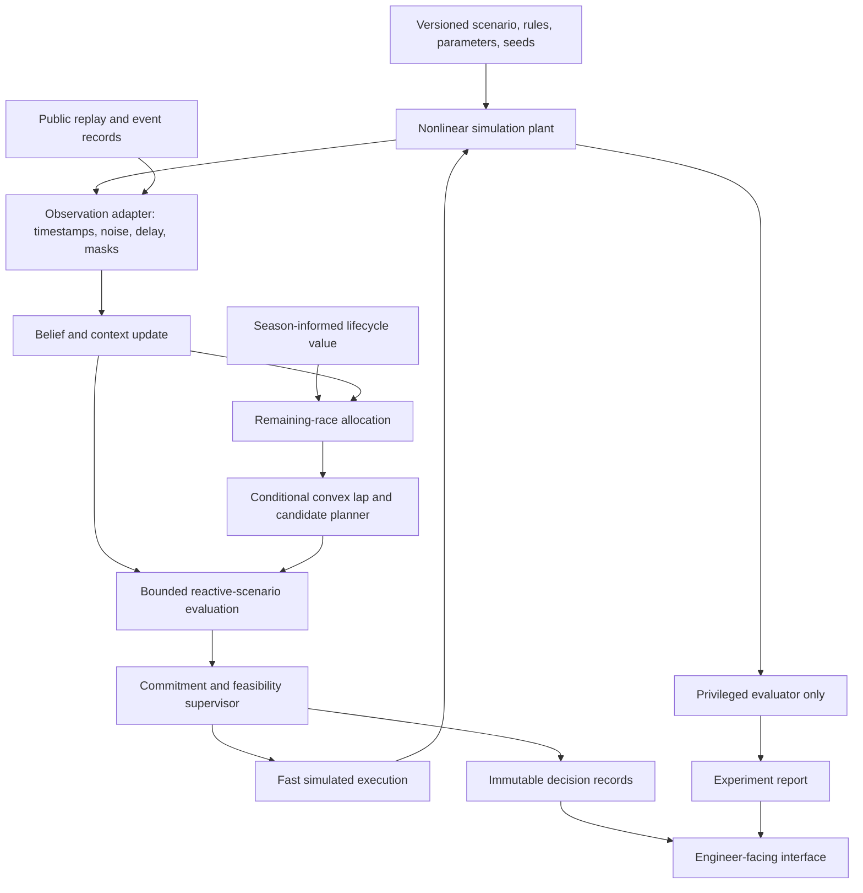

# Corrected architecture and end-to-end workflow

## 1. Architectural idea

GRID//OPS uses physics to constrain what either car could do, observations to narrow what the rival may be able to do, and forward simulation to value our alternatives. It deliberately separates **state inference**, **strategic choice**, **feasible execution** and **experimental scoring**.

The main external seam is the decision module: permitted decision input goes in; a traceable recommendation comes out. Both the experiment runner and future dashboard use that same interface. The simulator and replay source are different adapters at the observation seam. A reference controller and our controller are different adapters at the decision seam. These are real variations, not hypothetical abstraction layers.

## 2. Runtime workflow

Replay and simulation are separate run modes. Recorded observations do not advance an action-responsive physical plant. A replay can seed a separate modeled experiment, but the transition creates a new run with its own assumptions and identity.

The evaluator's truth has **no return path** into the controller, its cache, tuning process or displays available during action selection. Post-run analysis may compare beliefs against simulated truth. A deliberately privileged benchmark is a separately labelled adapter.

## 3. Four horizons and exchanged quantities

These rates and sizes are proposed starting configurations, to be revised after profiling. Simulation integration frequency is not telemetry frequency or decision frequency.

| Horizon | Required build / future method | Typical update | Downward interface | Upward feedback |
|---|---|---|---|---|
| H4: lifecycle/season | Configured marginal stress value; optional tiny synthetic dynamic program | Before an event; confirmed component change | Component constraints and time-equivalent marginal stress price; source and validity | Actual stress exposure, performance trade-offs and component evidence |
| H3: remaining race | Finite lap-map allocation with restricted pit alternatives | Lap boundary and major event | Lap energy budget, reachable reserve band, continuation-cost map | Achieved pace, resource state and reachable-target feedback |
| H2: lap/tactical windows | Conditional convex deployment profiles plus bounded interactive scenarios | Nominal 1 s, fresh significant evidence or invalidated plan | Selected power/speed/path references; validity interval; alternatives | Tracking residuals, revised hypotheses and limiting constraints |
| H1: execution | Feasibility projection and tracking; optional small tracking MPC | Nominal 50–100 ms; plant starts at 20 ms integration | Simulated actuator request | Tracking error, saturation, thermal/grip limits, target infeasibility |

H1 is not called MPC unless it actually optimizes a prediction horizon. H4 is not called season optimization if it only receives a configured stress price. In the full research architecture, H4 may optimize expected season utility, but its conversion into H3's cost units must be explicitly estimated; raw points cannot be added to seconds.

Budgets are requested targets, not commands to violate physics. H1 can reject H2; H2 can return a reachable energy interval to H3; H3 can report a conflicting lifecycle target. The latest valid plan is reusable only after a fresh feasibility check.

## 4. Deep modules

| Module | Interface responsibility | Implementation hidden behind the interface | Principal failure response |
|---|---|---|---|
| Scenario and rules | Resolve a complete versioned run specification | Track geometry, event permissions, parameter provenance and seed assignment | Refuse incomplete execution configuration |
| Simulation | Advance an episode under ego and rival actions | Dynamics, battery, tyres, contact geometry, exogenous events and sensor generation | Record numerical/physical failure; never silently repair scored state |
| Evidence and memory | Convert available evidence into a causal decision input and persistent context | Synchronization, source masks, feature windows, driver priors and component ledger | Widen uncertainty; retain unknown fields |
| Decision | Produce a recommendation from permitted input and previous controller state | Beliefs, candidate generation, conditional optimization, scenario comparison, commitment logic and supervisor | Revalidate baseline or return unavailable |
| Race value | Provide resource targets and continuation cost for a reachable state | Lap maps, remaining laps, restricted pit alternatives and lifecycle prices | Reject out-of-map query or explicitly use conservative fallback |
| Evaluation | Compare controller adapters on frozen episodes | Paired runs, metrics, calibration, failure accounting and privileged comparators | Mark run invalid with reason; retain its failure record |
| Records and presentation | Expose immutable experiment and decision records | Local storage, replay controls, plots, explanations and export | Display missing/unavailable; do not synthesize a result |

The race-value module earns a separate seam because a configured reference map and a later learned map are substitutable. Battery and tyre equations initially remain within the simulation implementation, with small numerical test interfaces; do not create separate network services for them.

## 5. Startup workflow

1. Validate organizer permissions, dataset reuse and selected event identity.
2. Resolve all parameter provenance; identify synthetic, fitted, paper-derived and verified rule inputs.
3. Load the controller's allowed artifacts only. Load plant-specific truth and evaluation seeds in a separate run context.
4. Verify track closure, units, initial-state bounds and ruleset completeness. Unknown event permissions disable the affected mode.
5. Build the reference pace/energy maps and candidate cache over a declared validity domain. Run known-answer numerical tests.
6. Initialize current fast-state priors. Reuse driver parameters only when context and training split permit. Do not restore a previous race's SOC as current truth.
7. Start the deterministic episode and append the run manifest before the first action.

## 6. One closed-loop decision cycle

1. Integrate to the next scheduled sensor, event or control time using the previously accepted actions.
2. Publish only observations whose `available_at` time has arrived. Preserve original sampling times and missingness.
3. Apply event records: tyre-set change, rules-mode authorization, weather change, confirmed component identity or penalty.
4. Propagate rival hypotheses using elapsed time and update with newly available, nonduplicated evidence.
5. Query remaining-race value and achievable energy targets. Replan H3 if new evidence makes the previous target unreachable.
6. Generate a bounded candidate set: reference, attack now, attack later, defend, conserve; optionally probe/feint.
7. Compute/reuse conditional convex profiles. Reject stale cache entries and profiles outside their validity domain.
8. Roll out each retained candidate against reactive rival hypotheses, with the same first action across indistinguishable futures.
9. Rank candidates against the reference using the configured criterion and continuation cost. Keep mean, downside and failure explanations in the record.
10. Apply the commitment rule and current-state feasibility supervisor. Return a plan with an expiry time, or a documented fallback/unavailable status.
11. Execute only the first control interval. Record saturation and feedback; the next cycle starts from the actual resulting state.

A controller may not use its hypothesized rival policy's private memory or sampled hidden truth to select different future actions before observations reveal that information. Rollout policies must obey the same observation contract as the deployed controller.

## 7. Memory and event workflow

| Event | Fast belief | Driver context | Component/tyre record |
|---|---|---|---|
| Normal observation | Bayesian propagation/update | Gradual contextual update on permitted data | Accumulate declared evidence |
| Missing observations | Predict forward; widen uncertainty | No fabricated evidence | Preserve last verified identity |
| New tyre set | Reset relevant wear/temperature prior | Preserve with context change | New set identity; old set retained in history |
| New session | Fresh SOC/temperature priors | Shrink/reuse compatible learned parameters | Preserve only supported component continuity |
| Confirmed battery replacement | Reinitialize battery-health prior | No automatic driver reset | New component identity and evidence |
| Grid penalty | Update starting/running-order implications as applicable | No implied aggression change | Record reason; no automatic SOH deduction |
| Changed car/weather behavior | Increase model uncertainty | Forget/shrink or change-point reset | Retain provenance, not false precision |

Battery state and driver behavior are not the same persistent object. Multi-race health inference with unknown component identity should remain a mixture over possible continuity, or simply unknown in the initial build.

## 8. Decision states

`RECOMMEND`: a departure from reference passed the configured commitment and modeled-feasibility checks.

`RETAIN_REFERENCE`: no candidate clears the improvement margin; this can be a rational choice under uncertainty.

`FALLBACK`: a solver/data/model issue forced a current-state-checked reference policy. Report the issue rather than describing it as strategic abstention.

`UNAVAILABLE`: no accepted model-feasible action or valid state can be established. The simulation records a failure or prescribed safe-termination experiment behavior; the human-facing interface does not invent a driving command.

Restrict plan switching with a configurable minimum hold period/hysteresis only when still feasible. A physical limit or expiry overrides that hold. This avoids repeated burn/harvest oscillation without concealing required replans.

## 9. Full architecture versus build feasibility

Full RL, exact game equilibria, detailed battery ageing and whole-season optimization are independent extensions, not dependencies of the main decision interface. The initial action library is deliberately small. Expensive solves generate candidate profiles; inexpensive reactive simulation evaluates them. Never launch a large nonlinear game solver at every tree node.

Scaling to a grid means selecting tactically relevant nearby rivals and treating distant cars through coarse race forecasts, then validating the approximation. No full-grid performance or strategic guarantee is part of this two-car design.

See [models](03-models-and-algorithms.md) for the mathematical specification, [contracts](04-data-and-contracts.md) for the development interface, and [ADR-0001](../adr/0001-truth-observation-separation.md) for the information-separation trade-off.
