# GRID//OPS — chronological architecture (block diagrams)

Status: derived from the corrected development package (v1.0). Diagram only — it adds no
requirements and no results. Where the specification says "target" or "proposed", the
diagram keeps that status.

This file shows **how the system runs in time**, from authorization through a single
decision tick, through episode termination, batch comparison, presentation and the claim
gates. Each section is one block diagram with a short legend.

Rendered copies (dark theme, SVG + 2× PNG) live in [diagrams/](diagrams/) — open
[diagrams/index.html](diagrams/index.html) to browse them all. The Mermaid source below is
the single source of truth; regenerate the rendered copies if the diagrams change.

## Diagram index

| # | Diagram | Question it answers |
|---|---|---|
| 1 | [Master chronology](#1-master-chronology) | What are the phases, in order, and where does the loop close? |
| 2 | [Phase 0–1: authorization and startup](#2-phase-01-authorization-and-startup) | What must be frozen before the first action? |
| 3 | [Phase 2: one closed-loop decision tick](#3-phase-2-one-closed-loop-decision-tick) | What happens inside one decision? |
| 4 | [Runtime sequence](#4-runtime-sequence) | Who calls whom, and when is data available? |
| 5 | [Four-horizon cascade H4→H1](#5-four-horizon-cascade-h4h1) | How do the planning horizons couple? |
| 6 | [Information separation / trust boundary](#6-information-separation--trust-boundary) | What can the controller never see? |
| 7 | [Event and memory chronology](#7-event-and-memory-chronology) | What resets, what persists, what widens? |
| 8 | [Decision outcomes and fallback](#8-decision-outcomes-and-fallback) | How does a recommendation get accepted or refused? |
| 9 | [Phase 3: termination and scoring](#9-phase-3-termination-and-scoring) | Who scores the episode and against what truth? |
| 10 | [Phase 4: experiment batch chronology](#10-phase-4-experiment-batch-chronology) | How does frozen comparison work? |
| 11 | [Phase 5: records to engineer interface](#11-phase-5-records-to-engineer-interface) | How does a display stay traceable? |
| 12 | [Build chronology T+0→T+24](#12-build-chronology-t0t24) | What is built when, and which gate blocks what? |
| 13 | [Module block map](#13-module-block-map) | Which code module owns which block? |
| 14 | [Claim release gates](#14-claim-release-gates) | What evidence unlocks which sentence? |

---

## 1. Master chronology

Top-level phase order. Phase 0 and Phase 1 run once. Phase 2 is the repeating episode
loop. Phases 3–5 run after the episode. Truth (red) never enters the controller (green).

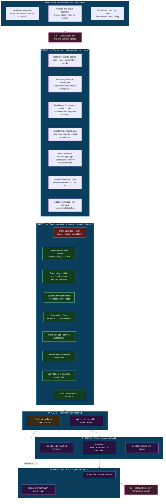

**Reading the loop:** only `L1` (the nonlinear plant) holds hidden rival truth. Everything
from `L2` to `L9` runs on permitted evidence. The transition `L9 → L1` closes the physical
loop; the integrity of that arrow is the whole design.

---

## 2. Phase 0–1: authorization and startup

The startup workflow is strictly ordered because each step can invalidate the next. An
unknown in `S2` or `S4` disables affected modes rather than defaulting.

```mermaid
flowchart LR
    classDef input fill:#132a3d,stroke:#7fd1ff,color:#eaf6ff;
    classDef proc fill:#123d1e,stroke:#8ff0a4,color:#eafff0;
    classDef block fill:#5c1a1a,stroke:#ff9a9a,color:#ffecec;
    classDef art fill:#2a1240,stroke:#c9a3ff,color:#f6ecff;

    IN1["Organizer rubric<br/>reuse · AI · licence"] --> D0{"Rules reusable?"}
    D0 -- no --> STOP1["Stop<br/>do not submit affected artifact"]
    D0 -- yes --> P0A["Select reference circuit<br/>+ event identity"]

    P0A --> P1A["Resolve provenance per parameter<br/>value · unit · source · valid range"]
    P1A --> P1B["Load allowed controller artifacts"]
    P1B --> P1C["Separate evaluator truth context<br/>plant seeds · hidden rival state"]
    P1C --> VAL{"Track closed?<br/>units consistent?<br/>bounds valid?<br/>ruleset complete?"}
    VAL -- no --> BLK["Disable affected mode<br/>record UNKNOWN, never silently default"]
    VAL -- yes --> MAP["Build H3 lap map + H2 candidate cache<br/>known-answer numerical tests"]
    MAP --> PRI["Initialize fast-state priors<br/>shrink sparse driver history"]
    PRI --> MAN["Write run manifest<br/>code hash · seeds · versions · caps"]
    MAN --> RUN["Episode may start"]

    class IN1 input
    class P0A,P1A,P1B,P1C,MAP,PRI,MAN,RUN proc
    class STOP1,BLK block
    class D0,VAL input
```

**Artifacts produced:** scenario JSON, ruleset JSON (nulls for unverified fields), parameter
provenance ledger, run manifest, reference maps, candidate cache, initial-state priors.

---

## 3. Phase 2: one closed-loop decision tick

The canonical eleven-step cycle from the architecture spec, drawn as blocks. The dashed
return is the physical closed loop; the solid left column is the information path.

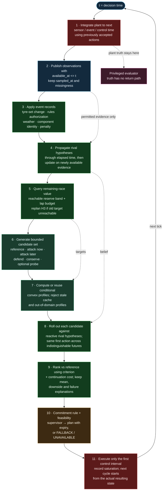

**Non-negotiable inside this tick**

- The controller cannot read the plant object, rival SOC, rival policy label or future samples.
- A rollout policy obeys the same observation contract as the deployed controller.
- The plan is the latest valid one only after a fresh feasibility check; expiry is explicit.
- Saturation and rejection are recorded, never hidden by clipping.

---

## 4. Runtime sequence

Same cycle as a sequence diagram, showing ownership and information timing. Note that the
evaluator receives truth in a separate, privileged channel.

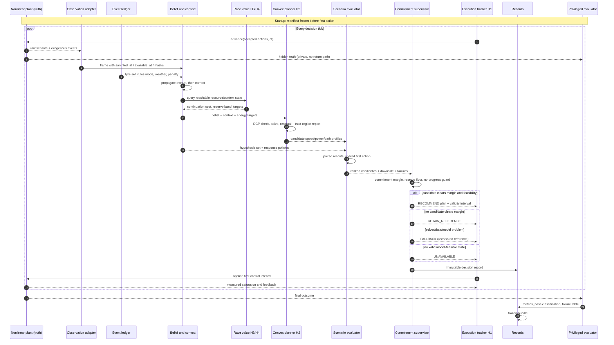

---

## 5. Four-horizon cascade H4→H1

Four rates, not four competing weighted scores. Downward arrows carry **compatible resource
targets and costs**; upward arrows carry **feasibility feedback**. Any lower layer can
reject an upper target.

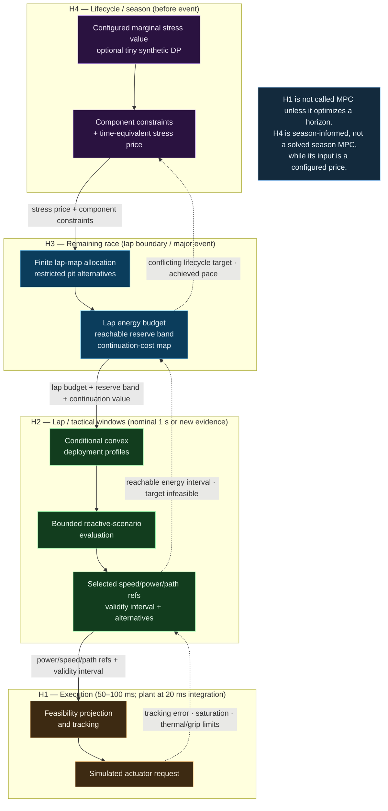

**Rate table (proposed starting configuration, subject to profiling)**

| Horizon | Update | Exchanges down | Exchanges up |
|---|---|---|---|
| H4 lifecycle | before event / component change | stress price, component constraints | stress exposure, performance trade-offs |
| H3 remaining race | lap boundary / major event | lap budget, reserve band, continuation cost | achieved pace, reachable targets |
| H2 lap/tactical | nominal 1 s / fresh evidence | profile refs, validity interval, alternatives | tracking residuals, revised hypotheses |
| H1 execution | 50–100 ms / 20 ms integration | simulated actuator request | saturation, thermal/grip limits, infeasibility |

---

## 6. Information separation / trust boundary

The single most important architectural constraint (ADR-0001). The evaluator may compare
beliefs with truth **after** the run; during action selection there is no return path.

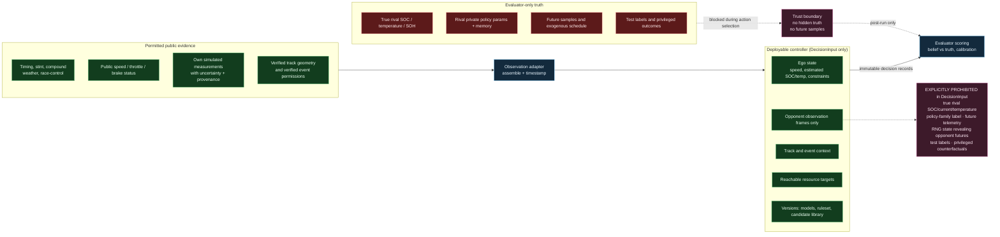

**Leakage tests that enforce this boundary:** mutate hidden rival state under fixed permitted
input (immediate action must not change); replace future telemetry (current features must not
change); ensure overlapping windows are not double-counted; ensure rollout controllers cannot
read sampled latent state; ensure cache keys never encode an evaluation label.

---

## 7. Event and memory chronology

Persistence is event-aware. Three memories move independently: fast race belief, driver/car
context, and the component/tyre ledger.

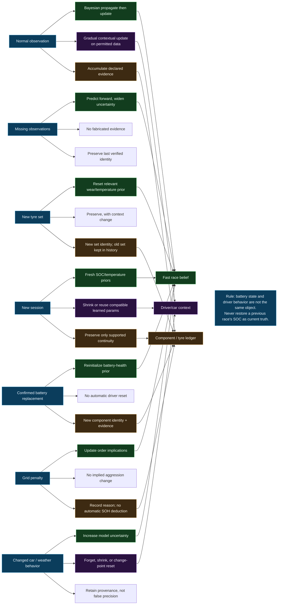

---

## 8. Decision outcomes and fallback

A recommendation is a **commitment**, not a status flag. `FALLBACK` (technical) and
`RETAIN_REFERENCE` (strategic abstention) must never be conflated.

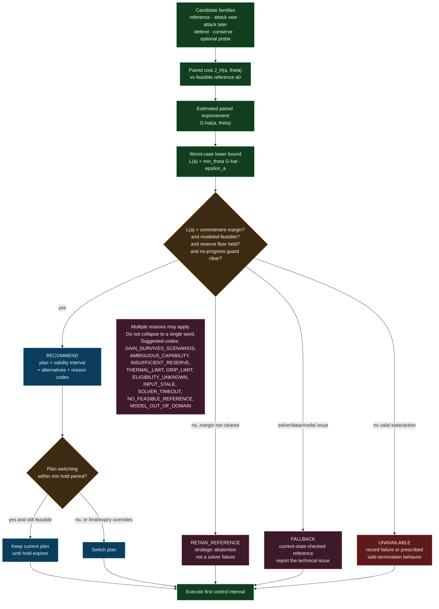

---

## 9. Phase 3: termination and scoring

The evaluator is the only component that sees truth. It scores calibration, not just outcome,
and it keeps failures.

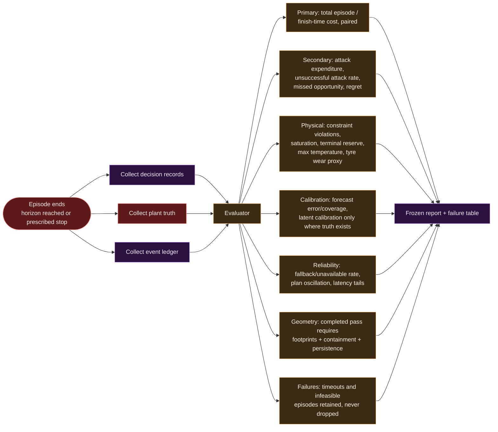

**Pass classification rule:** no contact and no track exit, ego rear clears rival front by a
configured margin, and the new order persists for a configured interval. Without the
geometric model, every output is labelled **catch-up only**.

---

## 10. Phase 4: experiment batch chronology

Frozen comparison. The same physical plant and observation contract for every method; only
the decision adapter changes.

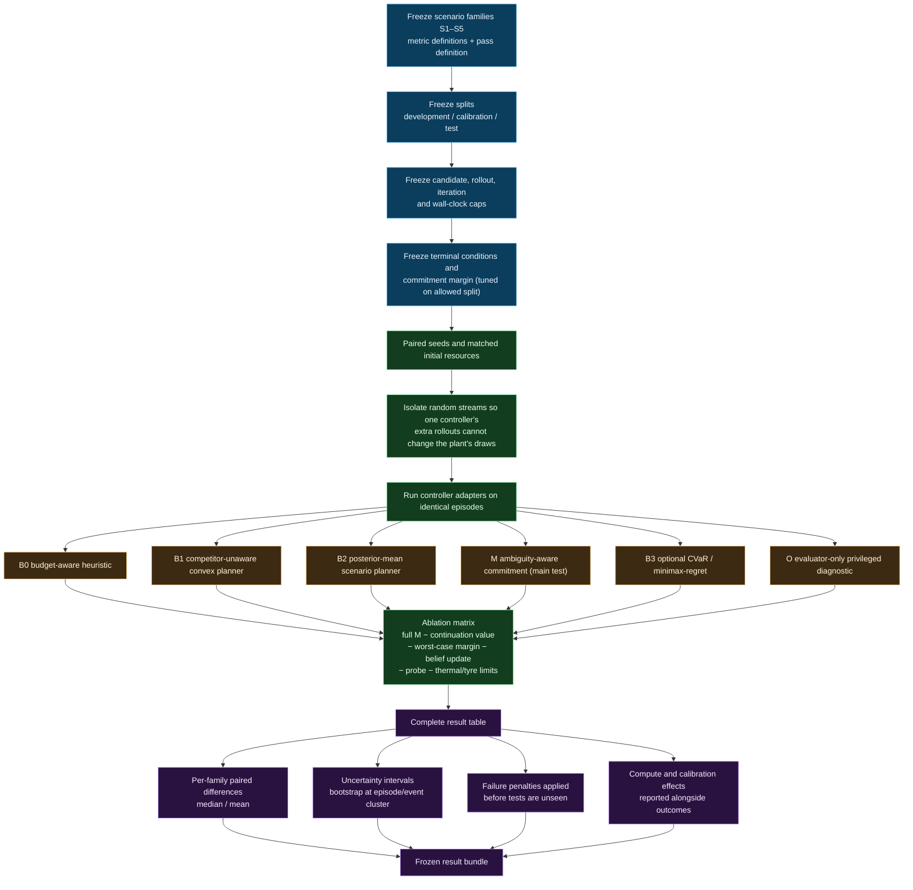

**Baseline roles (do not collapse them)**

| ID | Controller | What it isolates |
|---|---|---|
| B0 | Budget-aware heuristic | practical minimum comparator |
| B1 | Convex planner, competitor-unaware | value of interaction modelling |
| B2 | Posterior-mean scenario planner | ambiguity-aware commitment vs better search |
| M | Ambiguity-aware commitment | main method under test |
| B3 | CVaR / minimax regret | whether a risk criterion explains benefit |
| O | Privileged best feasible candidate | information-gap diagnostic, not deployable |

---

## 11. Phase 5: records to engineer interface

Presentation is a **projection** of immutable records. It cannot recompute or create results.

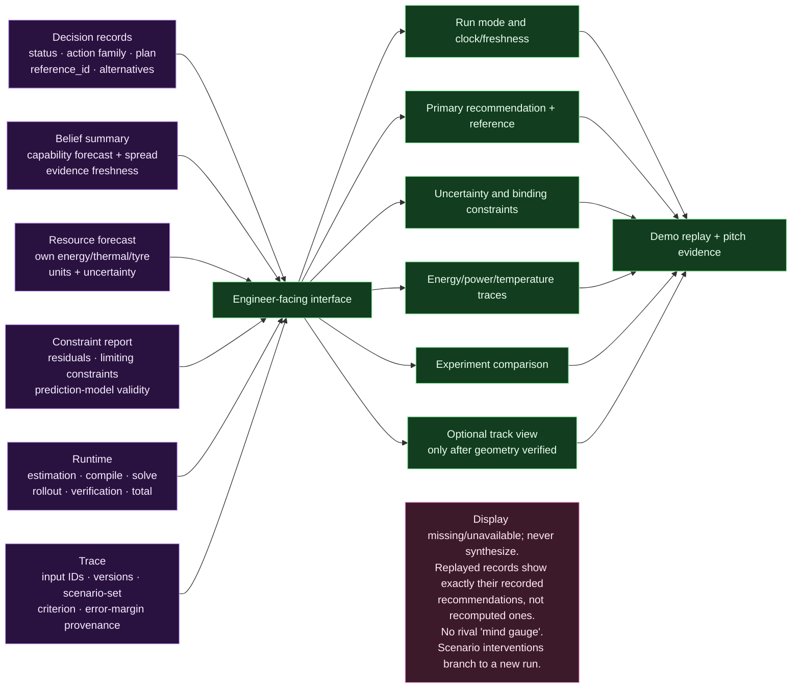

---

## 12. Build chronology T+0→T+24

Parallel lanes and integration gates from the two-person build plan. The vertical milestones
(`V1`–`V8`) are the required evidence; the gates (`G0`–`G5`) block progress.

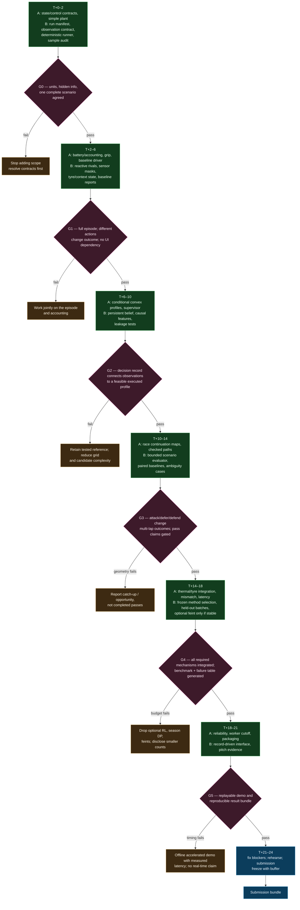

**Required vertical milestones:** (1) reproducible episode + manifest; (2) a
resource-constrained action changes speed, energy and later ability; (3) convex controller
shows residuals; (4) belief controller acts only on causal observations; (5) comparison
includes a reacting opponent and multi-lap value; (6) thermal/tyre changes alter feasible
choices and geometry is checked where claimed; (7) paired batch exports all results and
failures; (8) interface reads frozen evidence.

---

## 13. Module block map

Implementation mapping to the proposed layout, with current status from the engine
foundation. Module names below are the ownership boundaries, not network services.

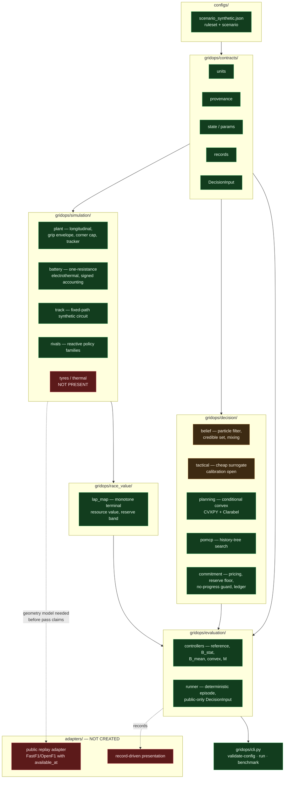

**Known open item (single most important):** belief calibration is not converged. The
surrogate closure scale in `decision/tactical.py` does not match the plant's observed
closure, so the controller's action distribution is dominated by the fixed probe schedule.
The G3 gate requires that against a conserving rival the credible set becomes
weak-dominated and M commits `attack_now`, while against a matching rival it retains.

---

## 14. Claim release gates

Each claim is unlocked only by its required evidence. Passing one level does not imply the
next. This is the chronology of what may honestly be said, in order.

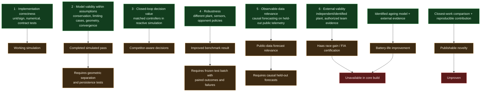

**Standing non-negotiables (apply at every phase):** no hidden rival truth or future samples
in the deployed controller; no synthetic state shown as measured F1 telemetry; no
solver-status flag substituting for physical and rule residuals; no thermal/wear proxy
reported as identified lifetime or measured loss; no guaranteed wins, safe overtakes, FIA
certification or unmeasured lap-time gains; no paper overriding the current event ruleset;
no external publication implied by these diagrams.

---

## Companion sources

- [PRD](01-prd.md) · [architecture](02-architecture.md) · [models](03-models-and-algorithms.md)
- [contracts](04-data-and-contracts.md) · [validation](05-validation-and-experiments.md) · [build plan](06-build-plan.md)
- [backlog](07-engineering-backlog.md) · [developer handoff](12-developer-handoff.md)
- [Mermaid source](architecture.mmd) · [ADR-0001 truth/observation separation](../adr/0001-truth-observation-separation.md)
- Domain vocabulary: [CONTEXT.md](../../CONTEXT.md) · engine status: [gridops/README.md](../../gridops/README.md)
